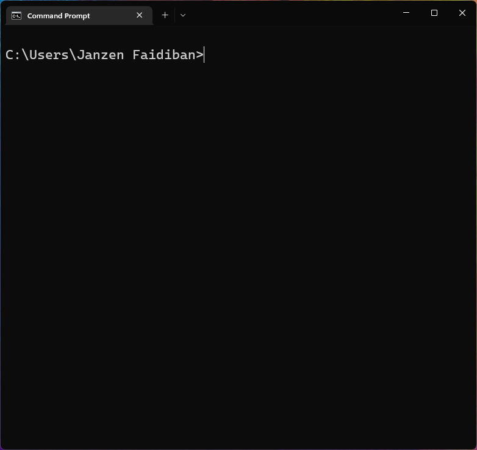
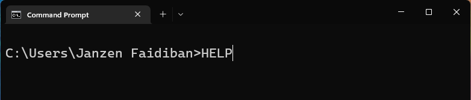
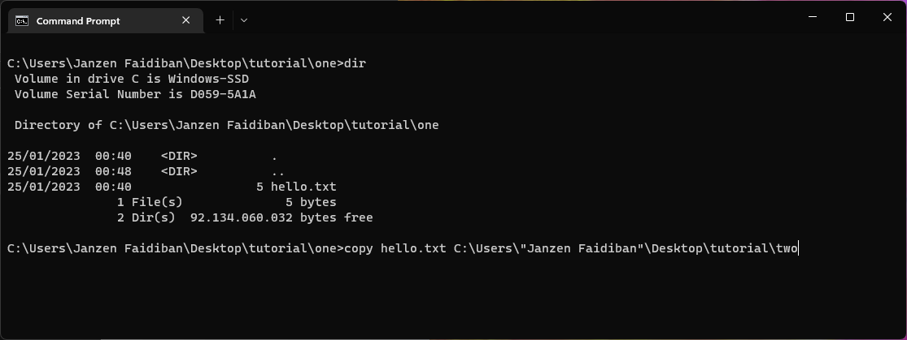
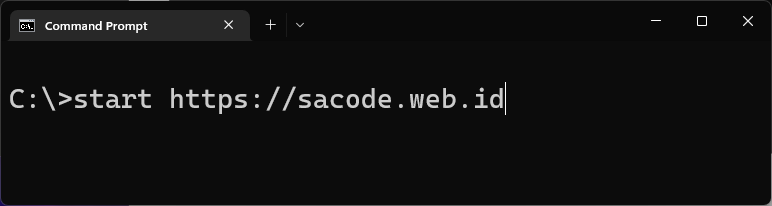
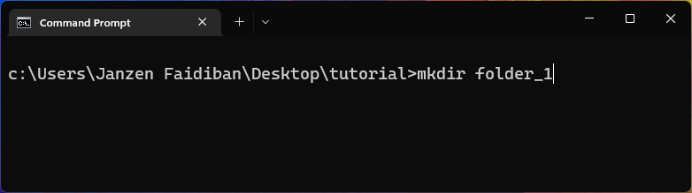
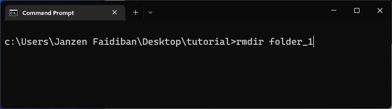
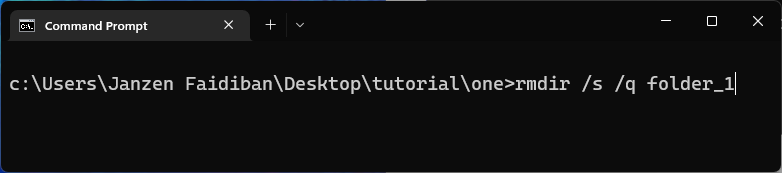

# Tutorial Dasar Penggunaan Perintah CLI di Windows

CLI (Command Line Interface) merpakan program yang dapat dijalankan menggunakan perintah-perintah teks.

Saat ini komputer telah berkembang dan menggunakan GUI (Graphical User Interface) dan kebanyakan pengguna komputer sudah tidak berinteraksi dengan CLI.

Tetapi, para developer dan programmer saat ini masih tetap menggunakan CLI dalam kegiatan coding atau pemrograman.

## Mengakses Command Prompt

Command Prompt merupakan program bawahan dari windows yang digunakan untuk mengeksekusi perintah-perintah CLI.

Di bagian "search", ketik ```CMD``` atau ```Command Prompt``` dan pilih untuk tampilkan.


Tampilan Command Prompt ketika terbuka pertama kali




## Perintah DOS di Windows

Perintah ```HELP```, menampilkan bantuan atau referensi daftar 'commands'

Ketik ```HELP``` atau ```help``` di Command Prompt, kemudian enter.



Hasil tampilan dari perintah ```HELP``` di layar Command Prompt


```DIR```, menampikan daftar folder dan file di dalam folder terpilih

```CD namafolder```, membuka folder

```CD..```, keluar dari folder satu level ke atas

```COPY```, menduplikasi file
Contoh duplikasi file ```hello.txt``` dari folder "one" ke folder "two"



```
copy hello.txt C:\Users\"Janzen Faidiban"\Desktop\tutorial\two
```
Penulisan nama folder ```"Janzen Faidiban"``` dimasukkan ke dalam petik dua karena ada spasi

```START```, membuka jendela baru dan jalankan program baru

Contoh membuka aplikasi Notepad di Windows, gunakan perintah
```start Notepad```.


Contoh membuka website SaCode di web browser, gunakan perintah ```start https://sacode.web.id```.



```MKDIR```, membuat folder baru
Contoh membuat folder baru dengan nama ```folder_1```, gunakan perintah ```mkdir folder_1```



```RMDIR```, menghapus folder

Contoh menghapus folder dengan nama ```folder_1```, gunakan perintah ```rmdir folder_1```



```RMDIR /s /q namafolder```, menghapus folder secara paksa. Biasanya, jika ada file / folder di dalam tersebut, akan muncul pesan batal. Sehingga perintah ini bisa digunakan untuk menghapus folder dan semua isinya.

Contoh menghapus folder dengan perintah ```rmdir /s /q folder_1```



```CLS```, membersihkan layar command prompt

## Referensi Belajar

Berikut sumber belajar yang bisa digunakan.

### W3Schools
What is CLI
https://www.w3schools.com/whatis/whatis_cli.asp