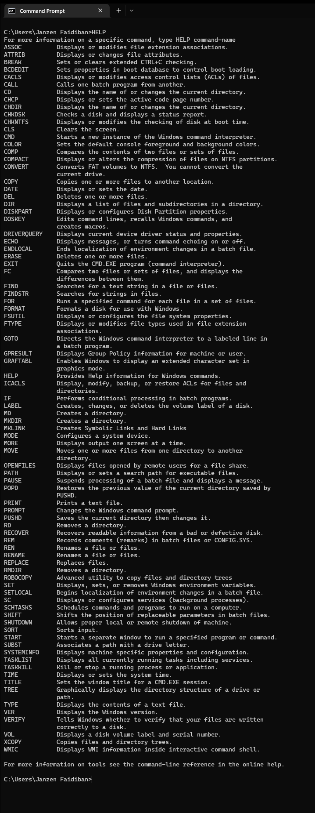

# Tutorial perintah-perintah cli di Windows

CLI (Command Line Interface) merpakan program yang dapat dijalankan menggunakan perintah-perintah teks.

Saat ini komputer telah berkembang dan menggunakan GUI (Graphical User Interface) dan kebanyakan pengguna komputer sudah tidak berinteraksi dengan CLI.

Tetapi, para developer dan programmer saat ini masih tetap menggunakan CLI dalam kegiatan coding atau pemrograman.

## Mengakses Command Prompt

Command Prompt merupakan program bawahan dari windows yang digunakan untuk mengeksekusi perintah-perintah CLI.

Di bagian "search", ketik ```CMD``` atau ```Command Prompt``` dan pilih untuk tampilkan.


Tampilan Command Prompt ketika terbuka pertama kali


## Perintah DOS di Windows

Perintah ```HELP```, menampilkan bantuan atau referensi daftar 'commands'

Ketik ```HELP``` atau ```help``` di Command Prompt, kemudian enter.


Hasil tampilan dari perintah ```HELP``` di layar Command Prompt



## Referensi belajar

Berikut sumber belajar yang bisa digunakan.

### W3Schools
What is CLI
https://www.w3schools.com/whatis/whatis_cli.asp